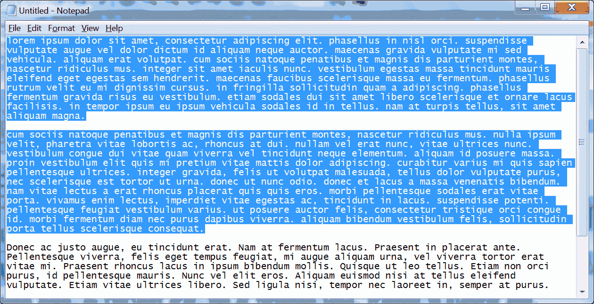

<!--MODERNIZED:v2-->
# Shift+F3 Case Changer

> Cycle selected text through five cases — anywhere, on any device.

[](https://socrtwo.github.io/shiftf3-SF/)
[](https://github.com/socrtwo/shiftf3-SF/releases)
[](LICENSE)
[](https://github.com/socrtwo/shiftf3-SF/actions)

The original 2010 AutoHotkey script that adds Word-style **Shift+F3**
case-cycling to every Windows app — now reborn as a multi-platform
project: a desktop daemon for Windows / macOS / Linux, a browser
extension for ChromeOS and any Chromium browser, and a PWA installable
on Android, iOS, and the web.

The cycle is:

> `iNVERT cASE` → `lower case` → `UPPER CASE` → `Title Case` → `Sentence case` → …

The selection is replaced and re-selected so successive **Shift+F3**
presses keep advancing the cycle.



---

## Installation

| Platform   | Release asset                          | What you get | Notes |
| ---------- | -------------------------------------- | ------------ | ----- |
| **Windows** (with AHK) | `shiftf3-windows-<v>.zip`     | Modernized AHK v2 script + legacy v1 scripts + icon | Requires [AutoHotkey v2](https://www.autohotkey.com/). Right-click → *Compile Script* if you want a standalone `.exe`. See [windows/README.md](windows/README.md). |
| **Windows** (no AHK)   | `shiftf3-py-windows-<v>.zip`  | `shiftf3-py.exe` — standalone, no runtime needed | Same global Shift+F3 hotkey, built with PyInstaller. See [desktop/README.md](desktop/README.md). |
| **macOS**              | `shiftf3-macos-<v>.tar.gz`    | Single-file binary, global Shift+F3 hotkey | Grant Accessibility + Input Monitoring permissions on first run. |
| **Linux**              | `shiftf3-linux-<v>.tar.gz`    | Single-file binary, global Shift+F3 hotkey | X11 sessions only — Wayland users should use the browser extension. |
| **ChromeOS**           | `shiftf3-extension-<v>.zip`   | Manifest V3 extension for Chrome / Edge / Brave / Vivaldi | Adds Shift+F3 to every editable field on every webpage. See [extension/README.md](extension/README.md). |
| **Android**            | (PWA) — install from the live page | Installable web app + optional Tasker recipe | See [mobile/README.md](mobile/README.md). |
| **iOS**                | (PWA) — install from the live page | Installable web app + optional Shortcut | See [mobile/ios-shortcut.md](mobile/ios-shortcut.md). |
| **Web**                | `shiftf3-web-<v>.zip` *or* the [live page](https://socrtwo.github.io/shiftf3-SF/) | Hosted PWA — works in any modern browser | Same source serves Web, Android, iOS, ChromeOS. |

Every release attaches the matching asset(s) — see the
[Releases page](https://github.com/socrtwo/shiftf3-SF/releases). The
release workflow (`.github/workflows/release.yml`) rebuilds them on
every `v*` tag push.

## Project layout

```
.
├── web/             ← PWA (web release; covers Web/Android/iOS/ChromeOS)
├── extension/       ← Manifest V3 browser extension (Chrome/Edge/Brave/Firefox)
├── windows/         ← Modernized AutoHotkey v2 script (compile locally for .exe)
├── desktop/         ← Cross-platform Python daemon (Windows/macOS/Linux)
├── mobile/          ← iOS Shortcut & Android Tasker recipe
├── scripts/         ← Build helpers (icon generation, etc.)
├── shift-F3-case-changer-0.52.ahk            ← Original 2010 AHK v1 script
└── shift-F3-case-changer-0.52-no-clipboard-preservation.ahk
```

A single shared **case engine** lives in three mirrored copies — JS for
the PWA (`web/case-engine.js`), JS for the extension content script
(`extension/case-engine.js`), and Python for the desktop daemon
(`desktop/case_engine.py`) — all producing identical output.

## How it works

* **Web/PWA** — pure HTML+CSS+JS, registers a service worker for
  offline use and a Web Share Target so other apps' share sheets can
  hand text to it.
* **Browser extension** — MV3 content script intercepts **Shift+F3**
  in any input, textarea, or contentEditable region; a service worker
  forwards the matching keyboard command for pages that swallow the
  keystroke.
* **Desktop daemon** — uses `pynput` to register a global hotkey and
  `pyperclip` to read/write the system clipboard; mimics the original
  AHK behavior of saving and restoring the previous clipboard content.
* **Windows AHK** — original v1 script preserved, plus a clean v2 port
  in `windows/`. Users with AutoHotkey installed can run the script
  directly or right-click → *Compile Script* for a personal `.exe`.
  Users who don't want AutoHotkey can grab the standalone Python
  build (`shiftf3-py-windows-*.zip`) instead — same hotkey, no
  runtime dependency.

## Development

```sh
# Run the desktop daemon from source
pip install -r desktop/requirements.txt
python -m desktop -v

# Smoke-test the case engine
python -m desktop.test_case_engine

# Serve the PWA locally
python -m http.server -d web 8080
# → http://localhost:8080/

# Regenerate icons (PWA + extension) from artwork
python scripts/make_icons.py
```

CI runs the engine tests and JS syntax checks on every push (see
`.github/workflows/build.yml`).

## Release

Push a `v*` tag — the **Release multi-platform builds** workflow
builds PyInstaller binaries for Windows / macOS / Linux, zips the
AutoHotkey source, the browser extension, and the PWA, and uploads
every artifact to a GitHub Release. Or run the workflow manually
from the Actions tab with a tag input.

The Windows AHK `.exe` is **not** compiled in CI — `Ahk2Exe` and the
official AHK installer hang on hidden GUI prompts in the
non-interactive runner environment. Users compile the script locally
in <10 seconds with AutoHotkey installed, or use
`shiftf3-py-windows-*.zip` for a no-runtime binary.

## Origin

This project was originally hosted on SourceForge as a single
AutoHotkey script. The legacy entry, if still available, lives at
<https://sourceforge.net/projects/shiftf3/>. The repository at
`socrtwo/shiftf3-SF` is the canonical, actively-maintained home — all
issue tracking and releases happen here.

* **Migrated with:** [SF2GH Migrator](https://github.com/socrtwo/sf-to-github)
* **Original Windows author:** Paul D Pruitt (socrtwo), with code
  from "None" and "Lazslo" of the AutoHotkey forum.

## Contributing

Issues and pull requests are welcome — see the
[issues page](https://github.com/socrtwo/shiftf3-SF/issues). New
platform builds (e.g. a real Android APK if accessibility-based
hotkeys ever land) should reuse the shared case engine so behavior
stays consistent.

## License

[MIT](LICENSE) — original SourceForge upload was distributed under
GPL-2.0 (`gpl-2.0.txt` is preserved for historical reference).

---

*Maintained by [@socrtwo](https://github.com/socrtwo).*
